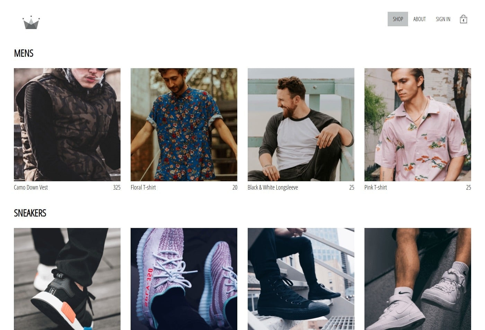

# Redux "Crown Clothes"

This project was bootstrapped with [Create React App](https://github.com/facebook/create-react-app).

### Install

* To start a project, you must set up all npm dependent commands.
> npm install

* Rename `.env.local.example` to `.env.local` and add your data settings in fields
* Create a new data base on [firebase.google.com](https://firebase.google.com/) website with name `crwn-db` and `users` collection. 
* All settings save to `.env.local`
 

### Available Scripts

In the project directory, you can run:
> `npm run start`

Runs the app in the development mode. 
Open [http://localhost:3000](http://localhost:3000) to view it in the browser.

### Built With

* [react-router-dom](https://github.com/ReactTraining/react-router/tree/master/packages/react-router-dom) - page routing
* [node-sass](https://github.com/sass/node-sass) - compiler in css from sass
* [gh-pages](https://pages.github.com/) - create a new repository with a live page on GitHub
* [firebase](https://github.com/firebase/firebase-js-sdk) - for connection with [firebase.google.com](https://firebase.google.com/) data base

