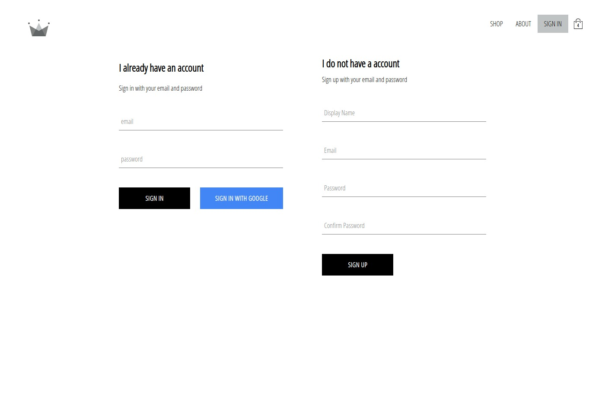

# Redux Shop "Crown Clothes"

This project was bootstrapped with [Create React App](https://github.com/facebook/create-react-app).

### Install

* To start a project, you must set up all npm dependent commands.
> npm install

* Rename `.env.local.example` to `.env.local` and add your data settings in fields
* Create a new data base on [firebase.google.com](https://firebase.google.com/) website with name `crwn-db` and `users` collection. 
* All settings save to `.env.local`

### .env.local

* REACT_APP_FIREBASE_SETTING - JSON with firebase settings
* REACT_APP_STRIPE_CHECKOUT_KEY - key from [dashboard.stripe.com](https://dashboard.stripe.com/). Credit card payment form
* REACT_APP_BASENAME_DOMAIN - basename path `http://localhost:3000/basename/` 
 

### Available Scripts

In the project directory, you can run:
> `npm run start`

Runs the app in the development mode. 
Open [http://localhost:3000](http://localhost:3000) to view it in the browser.

### Built With

* [react-router-dom](https://github.com/ReactTraining/react-router/tree/master/packages/react-router-dom) - page routing
* [node-sass](https://github.com/sass/node-sass) - compiler in css from sass
* [gh-pages](https://pages.github.com/) - create a new repository with a live page on GitHub
* [firebase](https://github.com/firebase/firebase-js-sdk) - for connection with [firebase.google.com](https://firebase.google.com/) data base
* [redux](https://github.com/reduxjs/redux) - is a predictable state container for JavaScript apps
* [react-redux](https://github.com/reduxjs/react-redux) - it lets React components read data from a Redux store, and dispatch actions to the store to update data.
* [redux-logger](https://github.com/LogRocket/redux-logger) - is a middleware for Redux. It will log actions to console
* [reselect](https://github.com/reduxjs/reselect) - Redux library for memoization selector and recalculates data from state when the value of state changes
* [redux-persist](https://github.com/rt2zz/redux-persist) - Persist and rehydrate a Redux store. Saves data locally to the browser store
* [react-stripe-checkout](https://github.com/azmenak/react-stripe-checkout) - easy to take people's money, credit card purchases
* [styled-components](https://styled-components.com/) - dynamic change of component styles by condition
* [redux-saga](https://redux-saga.js.org/) - async data middleware for Redux, intercept actions with side effects and handle them, Redux reducers remain pure.
* [www.kapwing.com](https://www.kapwing.com/404-illustrations?ref=producthunt) - page have images for error messages 

